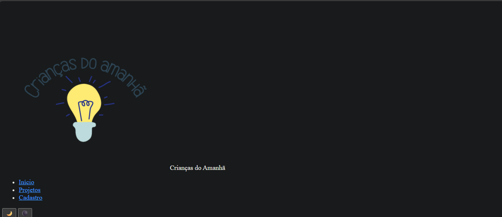
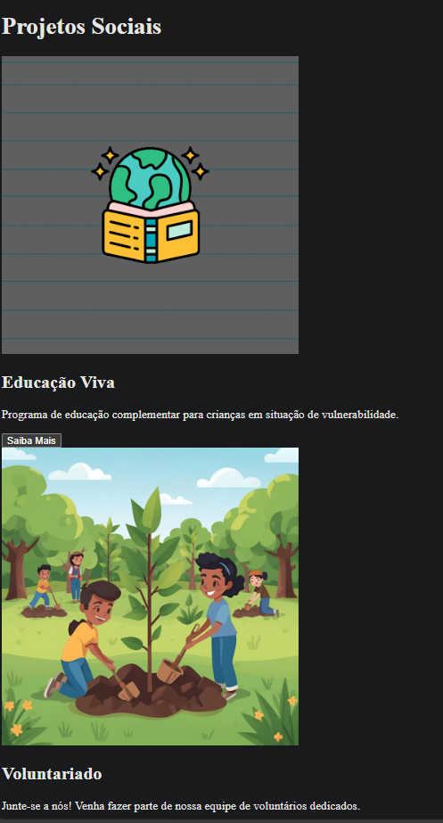
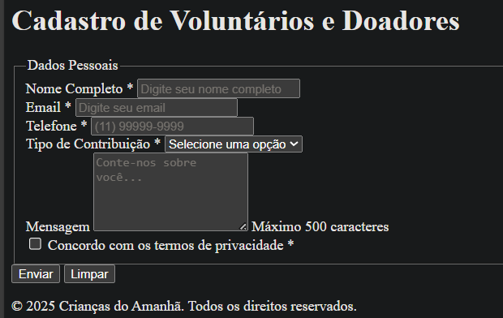
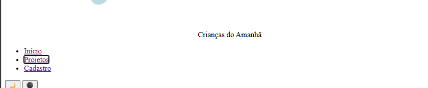

# Crianças do Amanhã - Plataforma Web

Uma plataforma web moderna e acessível para gerenciamento de atividades de ONG, desenvolvida como projeto acadêmico no curso de Análise e Desenvolvimento de Sistemas (ADS).

## Sobre o Projeto

A plataforma "Crianças do Amanhã" oferece:
- Sistema de Single Page Application (SPA) com navegação dinâmica
- Formulário de cadastro de voluntários e doadores
- Gerenciamento de projetos sociais
- Interface responsiva (mobile-first)
- Acessibilidade completa (WCAG 2.1 AA)
- Modo escuro e alto contraste

## Funcionalidades

- **SPA Dinâmica**: Navegação sem reload entre páginas
- **Validação de Formulário**: Verificação em tempo real com feedback visual
- **LocalStorage**: Persistência de dados do usuário
- **Acessibilidade**: 
  - Navegação por teclado (Tab, Enter)
  - Suporte completo para leitores de tela
  - Contraste WCAG AA (4.5:1)
  - Modo escuro acessível
- **Responsivo**: Desktop, tablet e mobile

## 🖼️ Screenshots de Comprovação

### Home com modo noturno

### Cards dos Projetos

### Página de Cadastro

### Home com modo claro (opcional)

## 🛠️ Tecnologias Utilizadas

- **Frontend**: HTML5, CSS3, JavaScript ES6+
- **Arquitetura**: SPA com padrão modular
- **Versionamento**: Git/GitHub com GitFlow
- **Acessibilidade**: WCAG 2.1 Nível AA
- **Otimização**: Minificação CSS/JS, compressão de imagens
- 3. **Acesse**: `http://localhost:8000`

## ♿ Acessibilidade

Este projeto segue as diretrizes WCAG 2.1 Nível AA:

- ✅ Navegação completa por teclado (Tab, Enter, Arrow Keys)
- ✅ Estrutura semântica adequada (nav, main, footer, etc.)
- ✅ Contraste de cores 4.5:1 para texto
- ✅ Labels explicativos para formulários
- ✅ Suporte para leitores de tela (ARIA labels)
- ✅ Modo alto contraste
- ✅ Modo escuro acessível

## 📝 Commits Semânticos

O projeto segue a convenção de commits semânticos:

- feat: nova funcionalidade
- fix: correção de bug
- docs: documentação
- style: formatação
- refactor: refatoração
- perf: performance
- test: testes
- chore: tarefas gerais

## 🔄 GitFlow

Estratégia de branching utilizada:

- `main`: Produção (releases estáveis)
- `develop`: Desenvolvimento (integração contínua)
- `feature/*`: Novas funcionalidades
- `release/*`: Preparação de releases

## 📦 Releases

Veja as [releases](https://github.com/bibicortezm/plataforma-ong-ads/releases) para histórico de versões.

## 🐛 Issues e Milestones

Acompanhe o progresso no [Projects](https://github.com/bibicortezm/plataforma-ong-ads/projects).

## 👥 Autor

**Bianca Cortez Martinez**
- GitHub: [@bibicortezm](https://github.com/bibicortezm)
- Email: [bi_cortez@hotmail.com](mailto:bi_cortez@hotmail.com)

## 📄 Licença

Este projeto é de código aberto sob a licença MIT.

## 🤝 Contribuindo

Contribuições são bem-vindas! Por favor:

1. Faça um Fork do projeto
2. Crie uma branch para sua feature (`git checkout -b feature/AmazingFeature`)
3. Commit suas mudanças (`git commit -m 'feat: add AmazingFeature'`)
4. Push para a branch (`git push origin feature/AmazingFeature`)
5. Abra um Pull Request

## 📞 Suporte

Para dúvidas ou sugestões, abra uma [Issue](https://github.com/bibicortezm/plataforma-ong-ads/issues).

**Última atualização**: 15/11/2025

## 🚀 Como Executar Localmente

1. **Clone o repositório**:
2. **Abra no navegador**:
- Opção 1: Abra `index.html` diretamente
- Opção 2: Use um servidor local
